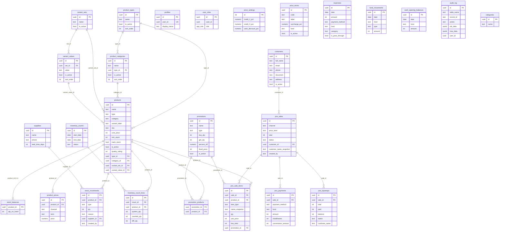

# 04 — Entity-Relationship Diagram

```mermaid
erDiagram
    product_types ||--o{ product_categories : "type_id"
    product_types ||--o{ products : "type_id"
    product_categories ||--o{ products : "category_id"
    variant_sets ||--o{ variant_values : "set_id"
    variant_sets ||--o{ products : "variant_set_id"
    variant_values ||--o{ products : "variant_value_id"

    products ||--o| stock_balances : "product_id (1:1)"
    products ||--o{ stock_movements : "product_id"
    products ||--o{ product_prices : "product_id"
    products ||--o{ pos_sale_items : "product_id"
    products ||--o{ promotion_products : "product_id"
    products ||--o{ inventory_count_lines : "product_id"

    suppliers ||--o{ stock_movements : "supplier_id"

    inventory_counts ||--o{ inventory_count_lines : "count_id"

    pos_sales ||--o{ pos_sale_items : "sale_id"
    pos_sales ||--o{ pos_payments : "sale_id"
    pos_sales ||--o{ pos_layaways : "sale_id"
    customers ||--o{ pos_sales : "customer_id"

    promotions ||--o{ promotion_products : "promotion_id"
    promotions ||--o{ pos_sale_items : "promotion_id"

    profiles {
        uuid id PK
        uuid user_id UK
        text display_name
    }

    user_roles {
        uuid id PK
        uuid user_id
        app_role role
    }

    products {
        uuid id PK
        text name
        text type
        text category
        text variant_label
        text sku
        int cost_price
        int min_stock
        bool track_stock
        bool is_active
        int quality_rating
        uuid type_id FK
        uuid category_id FK
        uuid variant_set_id FK
        uuid variant_value_id FK
    }

    product_types {
        uuid id PK
        text name
        bool is_active
        int sort_order
    }

    product_categories {
        uuid id PK
        text name
        uuid type_id FK
        bool is_active
        int sort_order
    }

    variant_sets {
        uuid id PK
        text name
        bool is_active
    }

    variant_values {
        uuid id PK
        uuid set_id FK
        text value
        bool is_active
        int sort_order
    }

    stock_balances {
        uuid product_id PK
        int qty_on_hand
    }

    stock_movements {
        uuid id PK
        uuid product_id FK
        text type
        int qty
        text reason
        uuid supplier_id FK
        text created_by
    }

    suppliers {
        uuid id PK
        text name
        text phone
        int lead_time_days
    }

    product_prices {
        uuid id PK
        uuid product_id FK
        text channel
        text term
        numeric price
    }

    price_settings {
        int id PK
        numeric credit_1_pct
        numeric credit_3_pct
        numeric cash_discount_pct
    }

    price_terms {
        uuid id PK
        text code
        text label
        numeric surcharge_pct
        text fund
        bool is_active
    }

    pos_sales {
        uuid id PK
        text channel
        text price_term
        int total
        text status
        uuid customer_id FK
        text customer_name_snapshot
        text created_by
    }

    pos_sale_items {
        uuid id PK
        uuid sale_id FK
        uuid product_id FK
        text item_type
        text name_snapshot
        int qty
        int unit_price
        int line_total
        uuid promotion_id FK
    }

    pos_payments {
        uuid id PK
        uuid sale_id FK
        text payment_method
        text fund
        int amount
        int installments
        int commission_amount
    }

    pos_layaways {
        uuid id PK
        uuid sale_id FK
        int total
        int paid
        int balance
        text status
        text customer_name
    }

    promotions {
        uuid id PK
        text name
        text type
        int buy_qty
        int get_qty
        numeric percent_off
        int fixed_price
        bool is_active
    }

    promotion_products {
        uuid promotion_id FK
        uuid product_id FK
    }

    customers {
        uuid id PK
        text full_name
        text email
        text phone
        text document
        text address
        bool is_active
    }

    expenses {
        uuid id PK
        date date
        int amount
        text payment_method
        text fund
        text category
        bool is_pass_through
    }

    fund_movements {
        uuid id PK
        date date
        text fund
        text type
        int amount
    }

    cash_opening_balances {
        uuid id PK
        date date
        text fund
        int amount
    }

    inventory_counts {
        uuid id PK
        date start_date
        date end_date
        text status
    }

    inventory_count_lines {
        uuid id PK
        uuid count_id FK
        uuid product_id FK
        int system_qty
        int counted_qty
        int diff_qty
    }

    audit_log {
        uuid id PK
        text table_name
        text record_id
        text action
        jsonb old_data
        jsonb new_data
        uuid user_id
    }

    categories {
        uuid id PK
        text name
    }
```
